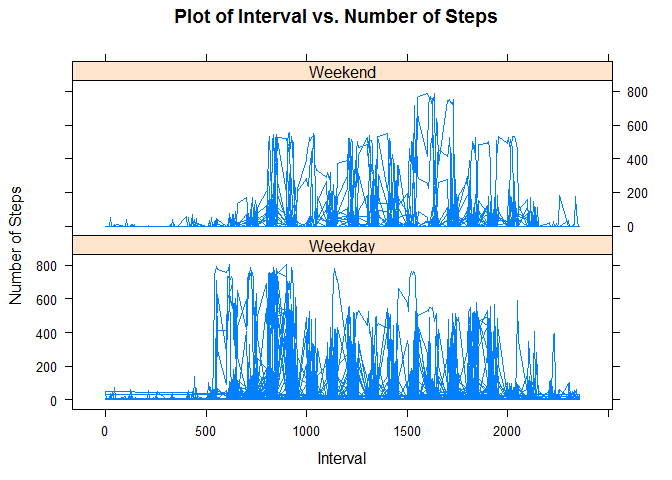

# Reproducible Research: Peer Assessment 1

### Loading and preprocessing the data for histogram

```r
data<- read.csv("activity.csv",header = TRUE)
library(lubridate)
library(ggplot2)
plotdata<-data[!is.na(data$steps),c("steps","date")]
```
### Ploting histogram for above data

```r
qplot(ymd(date),data=plotdata,xlab="Date",geom="histogram")
```

 

### What is mean total number of steps taken per day?
##### Aggregating data by each day & calculating mean

```r
library(dplyr)
agg_data<- summarize(group_by(plotdata,date),sum(steps))
colnames(agg_data)[2]<-"TotalSteps"
mean<-mean(agg_data$TotalSteps)
median<-median(agg_data$TotalSteps)
```
##### The mean is 10766   and    median is 10765
##### Ploting the mean median

```r
qplot( x=c("mean","median"), y = c(mean,median),ylab = "value") + geom_bar(stat = "identity",width=.25)
```

 


## What is the average daily activity pattern?

```r
filter_data<-data[!is.na(data$steps),c("steps","interval")]
avg_data<- summarize(group_by(filter_data,interval),mean(steps))
colnames(avg_data)[2]<-"AvgSteps"
```
####Plotting the time series chart

```r
plot(ts(avg_data$interval),avg_data$AvgSteps,type="l",xlab="Time Series",ylab="Avg Steps")
```

 


```r
max<-avg_data$interval[which.max(avg_data$AvgSteps)]
```
##### The time 835 in which has max no steps 
## Imputing missing values

```r
no_of_NA<-nrow(data[is.na(data),])
```
The total no of missing values in the dataset is 2304

Filling the missing values with 0

```r
data[is.na(data$steps),]$steps<-0
plotdata<-data[,c("steps","date")]
qplot(ymd(date),data=plotdata,xlab="Date",geom="histogram")
```

 
####Calculating mean & median

```r
agg_data<- summarize(group_by(plotdata,date),sum(steps))
colnames(agg_data)[2]<-"TotalSteps"
mean<-mean(agg_data$TotalSteps)
median<-median(agg_data$TotalSteps)
```
##### The mean is 9354   and    median is 10395
## Are there differences in activity patterns between weekdays and weekends?

```r
data$date <- weekdays(as.Date(data$date))
```
# Replacing the names of week day with "Weekday" and "Weekend":

```r
data$date[data$date == "Friday"] <- "Weekday"
data$date[data$date == "Monday"] <- "Weekday"
data$date[data$date == "Thursday"] <- "Weekday"
data$date[data$date == "Tuesday"] <- "Weekday"
data$date[data$date == "Wednesday"] <- "Weekday"
data$date[data$date == "Saturday"] <- "Weekend"
data$date[data$date == "Sunday"] <- "Weekend"
table(data$date)
```

```
## 
## Weekday Weekend 
##   12960    4608
```
#Creating the panel plot containing a time series plot of the 5-min interval
#and the average number of steps taken, averaged across all 
#weekday days or weekend days.

```r
library(plyr)
library(lattice)
newmnsteps<- ddply(data, c("interval", "date"), function(x) apply(x[1], 2, mean))
xyplot(data$steps ~ data$interval | data$date, 
       type="l", ylab="Number of Steps", xlab="Interval",
       main="Plot of Interval vs. Number of Steps", layout=c(1,2))
```

 
